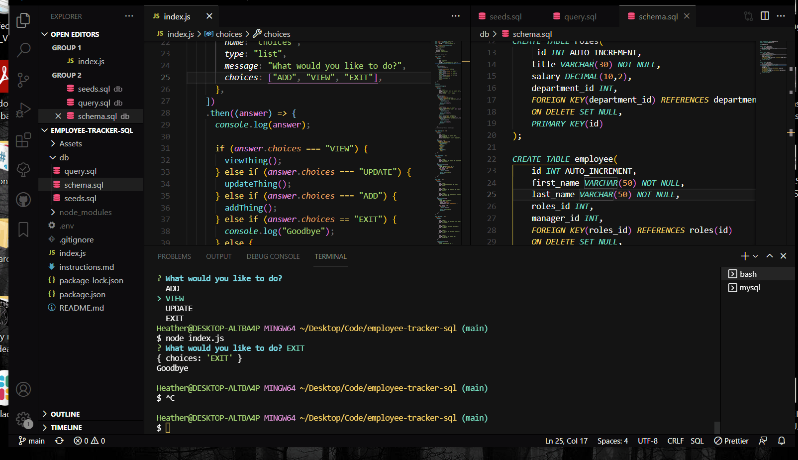

## employee-tracker-sqlDescription

# Description
A database to keep track of employees and their department

# Instructions
Add and a department and then add the role of the emplyee with their title, salary and department id. Then you will be able to enter their first and last name with their role id and if they are a manager or not. 

# Technologies
 sql

# Project Status
Finished

# Contributions
Louis, Brett, Denise, Isaac and myself for trying so damn hard and not giving up

# Licence
None

